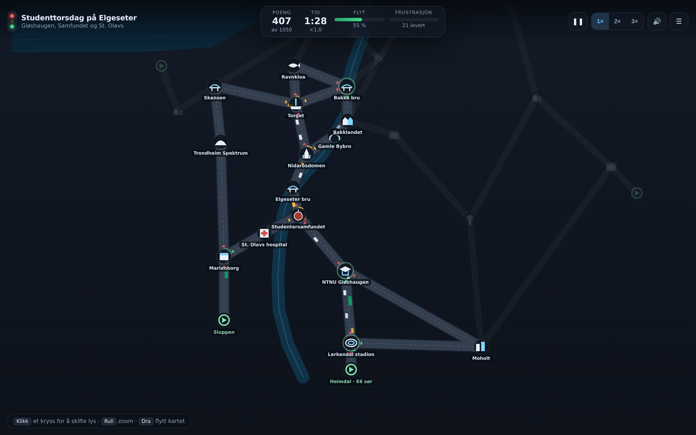

# Trondheim Trafikk

Et lite simulatorspill der oppgaven er å holde trafikken i flyt gjennom Trondheim.
Du styrer lysene i kryssene mens biler, taxier og metrobusser skal fram til
Nidarosdomen, Solsiden, Gløshaugen, Lerkendal og resten av byen.



## Kom i gang

Spillet er ren HTML, CSS og JavaScript — ingen byggesteg, ingen avhengigheter.

```bash
# åpne direkte
open index.html            # macOS  (xdg-open på Linux)

# eller server det lokalt
npx http-server -p 8080
```

Fungerer i alle moderne nettlesere, også på mobil.

## Slik spiller du

| Handling | Mus / tastatur | Berøring |
| --- | --- | --- |
| Skift grønn retning i et kryss | klikk på krysset | trykk på krysset |
| Zoom | rull med musehjulet | knip med to fingre |
| Flytt kartet | dra | dra |
| Pause | `mellomrom` eller `Esc` | pauseknappen |
| Simuleringsfart | `1` `2` `3` | 1× / 2× / 3× |
| Start brettet på nytt | `R` | «Prøv igjen» |

Når du har valgt et kryss, kan du også justere **omløpstiden** — hvor lenge hver
grønnfase varer. Korte omløp gir hyppigere bytter, lange omløp gir bedre flyt i
hovedretningen. Det er her de fleste poengene ligger.

### Reglene

- **Poeng** får du for hvert kjøretøy som kommer fram. Rask levering gir bonus,
  metrobusser teller mest, og en rekke raske leveringer bygger opp en
  kombomultiplikator (opptil ×3).
- **Flyt** viser hvor stor andel av bilene som faktisk er i bevegelse.
- **Frustrasjon** stiger når køene blir for lange eller noen har stått fast for
  lenge. Går den til 100 %, låser byen seg og brettet er tapt.
- Brettet er vunnet når tiden er ute og du har nådd poengmålet.

## Kartet

Kartkoordinatene er projisert fra faktiske lengde- og breddegrader, så
geografien stemmer noenlunde med virkeligheten: Midtbyen ligger i elveslyngen,
Bakklandet på østsiden av Nidelva, Gløshaugen og Lerkendal i sør og Lade mot
nordøst.

31 steder er med — blant andre Nidarosdomen, Gamle Bybro, Torget, Ravnkloa,
Bakklandet, Solsiden, Kristiansten festning, Trondheim S, Pirbadet, Rockheim,
Trondheim Spektrum, St. Olavs hospital, Studentersamfundet, NTNU Gløshaugen,
Lerkendal stadion, Tyholttårnet, Moholt, Lade, Leangen og Munkholmen ute i
fjorden — knyttet sammen av 41 navngitte gater fra Kongens gate og Munkegata til
Innherredsveien, Elgeseter bru og Omkjøringsvegen.

### Brettene

| # | Brett | Varighet | Mål |
| --- | --- | --- | --- |
| 1 | Mandag morgen i Midtbyen | 120 s | 850 |
| 2 | Studenttorsdag på Elgeseter | 150 s | 1050 |
| 3 | Lørdagskveld på Solsiden | 165 s | 1250 |
| 4 | Kampdag på Lerkendal | 180 s | 1200 |
| 5 | Hele Trondheim i rushtida | 210 s | 2100 |

Brettene åpnes etter hvert som du klarer dem, og rekordene lagres lokalt i
nettleseren.

## Under panseret

```
index.html        oppsett og grensesnitt
css/style.css     stilark
js/data.js        veinett, steder, kystlinje, Nidelva og brettdefinisjoner
js/engine.js      simuleringen: biler, ruter og trafikklys
js/render.js      canvas-tegning av kart, kjøretøy og signaler
js/game.js        spillflyt, input, HUD og lagring
```

Bilene følger en forenklet **IDM-modell** (Intelligent Driver Model): hver bil
justerer farten etter avstanden til bilen foran, til stopplinja ved rødt lys, og
til den første bilen i gata den skal inn i — slik at ingen kjører seg fast midt i
krysset. Ruter beregnes med Dijkstra på kjøretid når bilen settes ut.

Hvert kryss med tre eller flere gater får et lys med to grønnfaser. Fasene
settes opp automatisk ved å prøve alle todelinger av tilfartsveiene og velge den
der gatene i hver gruppe peker mest mulig i samme retning — altså naturlige
«nord–sør»- og «øst–vest»-faser.
